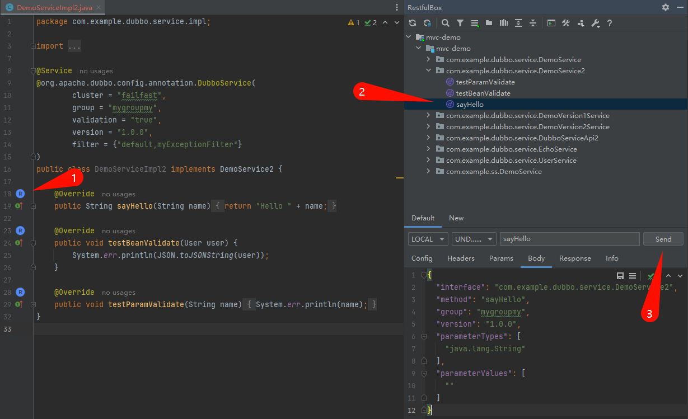
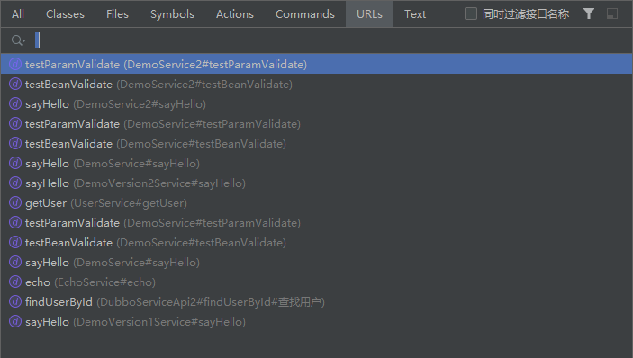
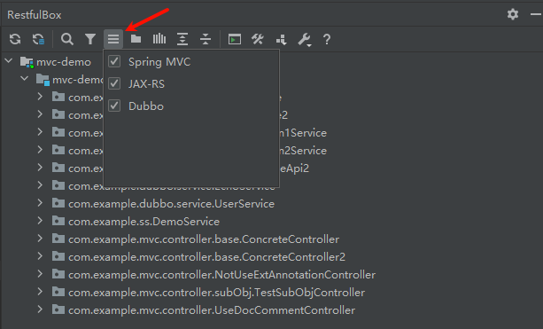
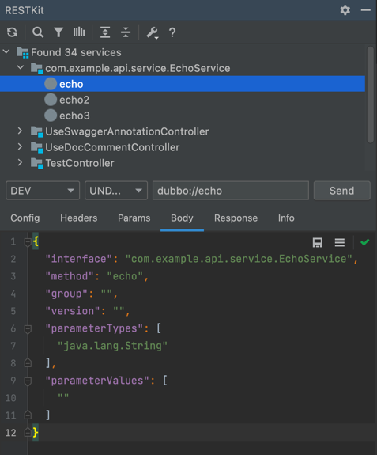

# RestfulBox-Dubbo

[简体中文](./README.zh_CN.md)

[RestfulBox-Dubbo](https://plugins.jetbrains.com/plugin/18828-restkit-dubbo) is a plugin that support Dubbo scanning and request for [RestfulBox](https://plugins.jetbrains.com/plugin/14723-restfulbox) plugin from version 2.0.0.

If this plugin helps, please **🌟Star**! If you have any good idea, please let me know.

## Features
- Support most RestfulBox features.
- Support scanning dubbo services in java project.
- Support sending dubbo request.
- Support jumping to tree in the dubbo method from service impl.

## Install
- **Using IDE plugin system**

Recommended <kbd>Preferences(Settings)</kbd> > <kbd>Plugins</kbd> > <kbd>Browse repositories...</kbd> > <kbd>find "RestfulBox-Dubbo"</kbd> > <kbd>Install Plugin</kbd>

## Usage

After installed this plugin, you should enable it in `RestfulBox` setting. Refresh in `RestfulBox` window.

You will see.

UI introduction:

- Config: request config for dubbo, can use environment variable. Content:
  - registry: registry address, support zookeeper only. The default is `{{registry}}`. Without this pair or env variable, will use`zookeeper://127.0.0.1:2181`.
  - url: dubbo direct url like `dubbo://127.0.0.1:20880`. The default is `{{url}}`. Without this pair or env variable, will not use.
  - timeout: request timeout, the default is 2000ms. Without this pair, will use 5000ms.
  - applicationName: the default is RESTKit-Dubbo-proxy.
  - retries: the default is 0.
  - check: the default is false.
  - loadbalance: no default.
- Headers: use as dubbo attachments.
- Params: useless, just ignore.
- Body: dubbo generic request content, can't use env variable.
- Response：response content.
- Info：request and response info.